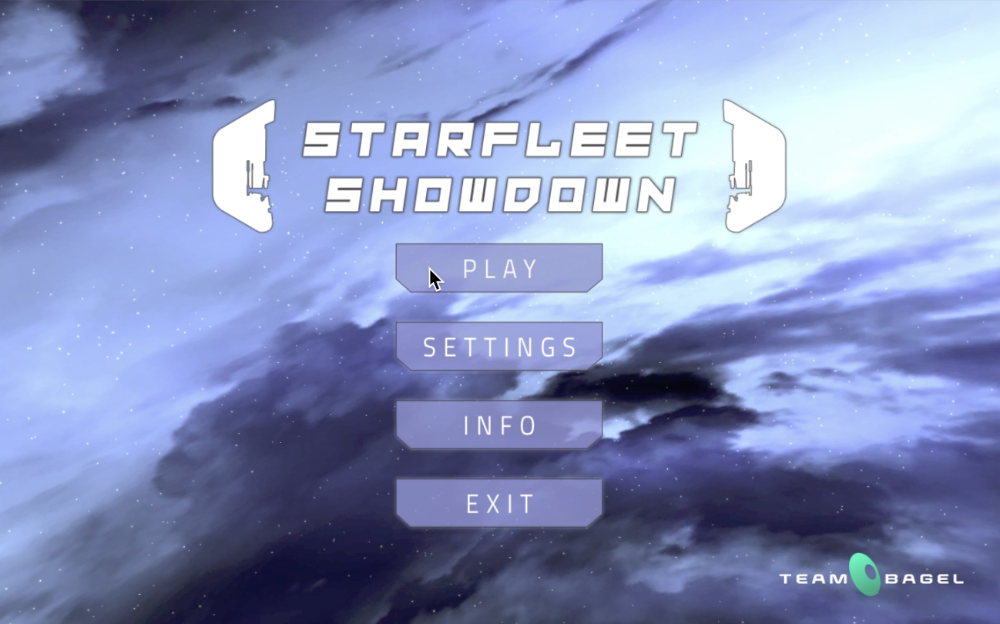
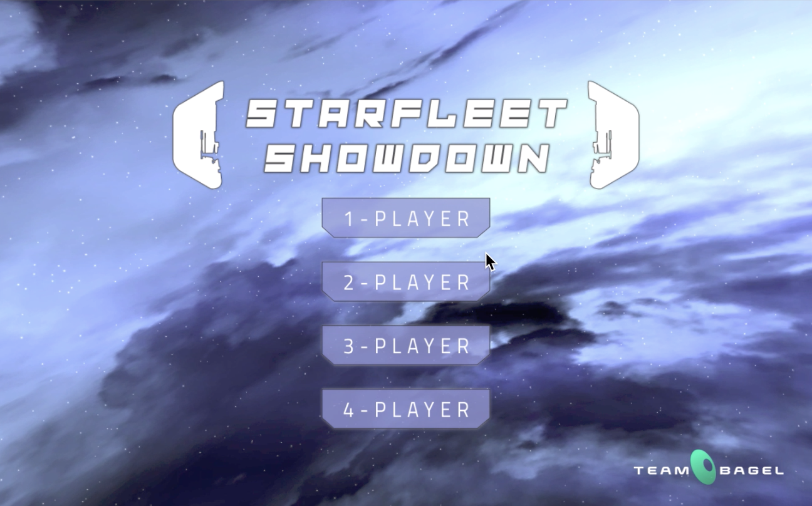
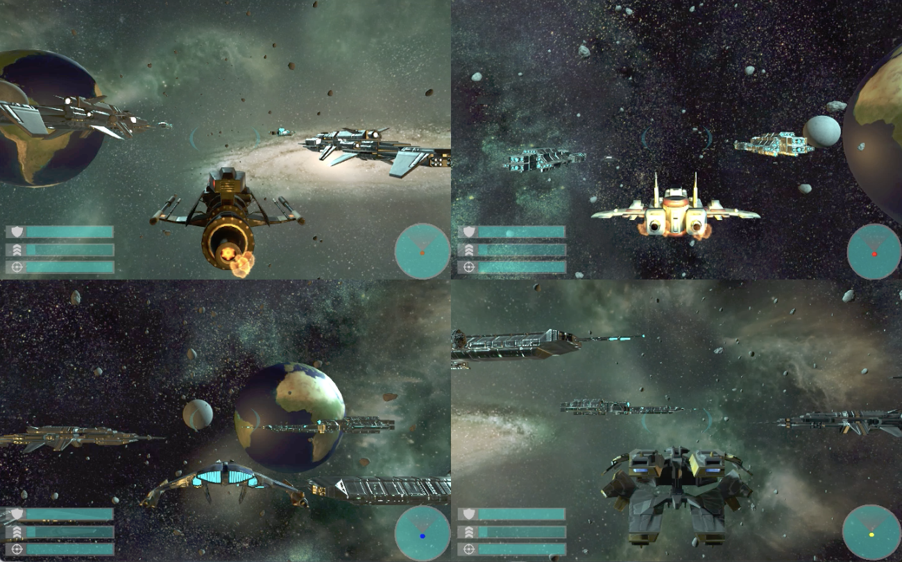

# Starfleet-Showdown
Created my Joshua Sun(me), Andrew Yuan, Gabriel Gomez, and Brett McCausland

## Overview
Starfleet Showdown is a space-themed aerial dog-fighting simulator where you and up to 3 other friends fly spaceships through Space and try to shoot each other out of the cosmos. The objective of the game is to be the last spaceship alive. Players navigate through a dynamic environment filled with asteroids and large capital ships. Once players find each other, they can eliminate each other using their spaceship’s lasers. By default, player 1 is controlled by keyboard and mouse. Players 2-4 are controlled by Xbox controllers.
* 1-player mode fights AI
* 2-4 player mode is PVP.

## Resources
https://drive.google.com/open?id=1w2SGZrojDogvYr1QLm1CcNEsTJrm-Hds)
* See GameDemo.mp4 for gameplay
* See Starfleet Showdown.zip for unity project and windows game executable
* See Report.docx for implementation details
* See Scrum Sheet.xlsx for individual contribution details

## Photos

## My Contribution
* Creation of the Main Menu 
* Mouse/Keyboard controls for the plane
* Split-screen/camera appropriately based on player mode
* Enemy AI for single-player mode
* Testing for various game components
* Project Scrum Master
